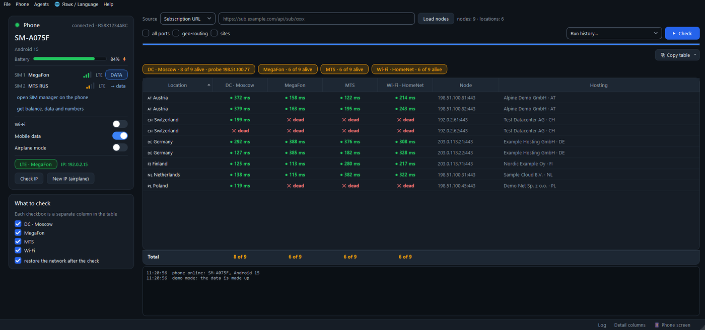
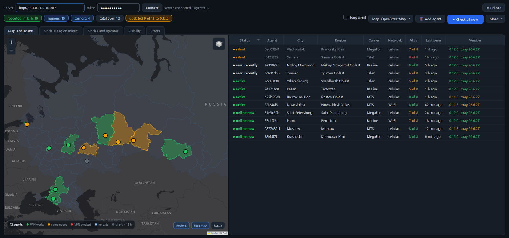
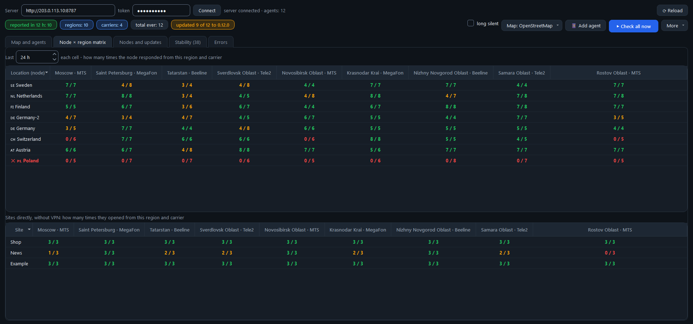
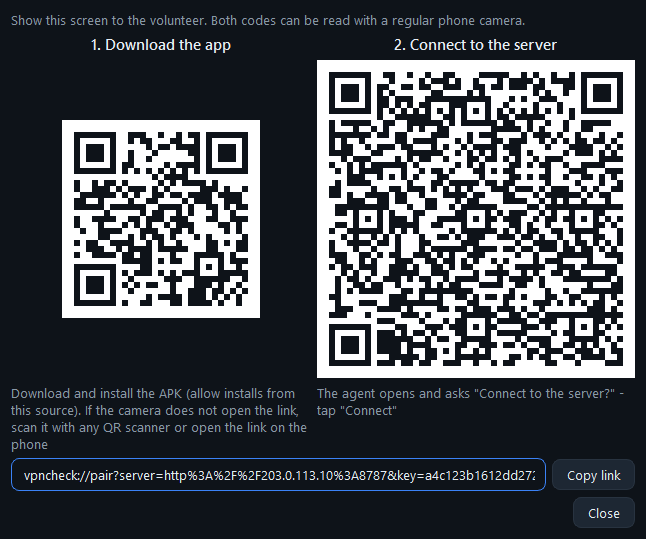
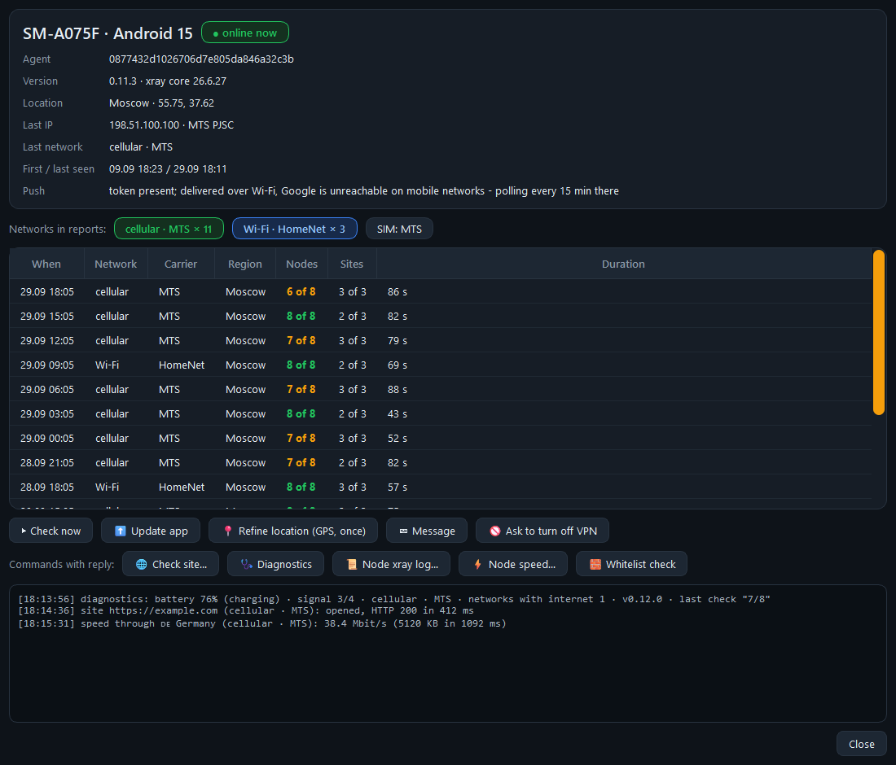

# VPNCheck Stand

[Русская версия](README.ru.md)

**VPNCheck Stand checks whether your VPN nodes are reachable from real networks** - from SIM cards of
different carriers, from home Wi-Fi, from different regions. A server in a data center tells you that a node
is alive, but not whether it opens tonight from a phone on a particular carrier. For that you need a
measurement point inside that network.

The measurement points are:

- **phones on a cable** - ordinary Android phones plugged into the PC over USB. Each SIM card and the phone's
  Wi-Fi is a separate column in the report. No root needed;
- **a data center point** (optional) - your Linux server, a "DC" column for comparison;
- **volunteers with the agent** (optional) - an Android app that checks the nodes from the volunteer's network
  every few hours and sends the result to your server. All agents are shown on a map and in a node x region
  table.

**Who it is for:** people who run their own Xray nodes (VLESS and anything else Xray can dial), for example with
a Remnawave panel, and want to know on which carriers and in which regions the nodes open and where they don't.



## Contents

- [Quick start in 5 minutes](#quick-start-in-5-minutes)
- [Installing the stand](#installing-the-stand)
  - [Requirements](#requirements)
  - [First check with a phone](#first-check-with-a-phone)
  - [Reading the report](#reading-the-report)
  - [Node sources](#node-sources)
  - [Data center point](#data-center-point)
  - [Several phones](#several-phones)
  - [Console runs](#console-runs)
  - [Update the stand](#update-the-stand)
- [Agent server](#agent-server)
  - [Install on the server](#install-on-the-server)
  - [Install from Windows over SSH](#install-from-windows-over-ssh)
  - [Connect the stand](#connect-the-stand)
  - [Telegram alerts](#telegram-alerts)
  - [Backups and database size](#backups-and-database-size)
  - [Encryption (TLS)](#encryption-tls)
- [Agent](#agent)
  - [Update signing key](#update-signing-key)
  - [Build the APK](#build-the-apk)
  - [Publish nodes and the APK](#publish-nodes-and-the-apk)
  - [Connect a volunteer](#connect-a-volunteer)
  - [What the agent sends](#what-the-agent-sends)
- [Security](#security)
- [Troubleshooting](#troubleshooting)
- [Reference](#reference)
  - [How a check works](#how-a-check-works)
  - [Where settings live](#where-settings-live)
  - [Repository layout](#repository-layout)
  - [Development](#development)
- [License](#license)

## Quick start in 5 minutes

You can look around without phones or servers - in demo mode with made-up data.

On Windows 10/11 open PowerShell:

```powershell
git clone https://github.com/SautovAndrey/vpncheck-stand.git
cd vpncheck-stand
powershell -ExecutionPolicy Bypass -File install.ps1
python app.py --demo
```

No Git? On the repository page press **Code -> Download ZIP**, unpack it and run `install.ps1` from that folder
(or install Git: `winget install Git.Git`).

`install.ps1` installs everything needed: Python 3.12 (if there is no Python 3.10+), `adb` and `scrcpy` via
winget, the Python packages, the Xray core for phones (official XTLS/Xray-core release, SHA-256 checked) and a
"VPNCheck Stand" shortcut on the desktop. It is safe to run again - what is already installed is skipped.

On any other system with Python 3.10+:

```bash
python -m pip install -r requirements.txt
python tools/fetch_binaries.py       # bin/xray, bin/geoip.dat, bin/geosite.dat + agent's libxray.so
python app.py --demo
```

## Installing the stand

The stand is a desktop program (Python + Qt). You can use it on its own and add the agent server and agents
later.

```
      Remnawave panel (API token)  /  subscription URL  /  file
                              |
                              v
  +-------------------- Stand (Windows PC) --------------------+
  |  report table, run history, agent control center           |
  +------+-------------------+--------------------------+-------+
         | USB / ADB         | SSH                      | HTTP(S) + admin token
         v                   v                          v
  Android phones        DC server                 Agent server (FastAPI, :8787)
  SIM 1 / SIM 2 / Wi-Fi (Linux, xray)             /v1/*, /admin, /agent.apk
  xray runs on the                                     ^              |
  phone, no root                                reports|              | nodes + signed
                                                       |              v update manifest
                                                Volunteer phones (Agent app)
                                                mobile data / Wi-Fi, anywhere
```

### Requirements

- **PC:** Windows 10/11 (the installer and launcher are for Windows), Python 3.10+, a USB data cable per phone.
  For two or more phones - a USB hub with its own power supply.
- **Stand phones:** Android 11 or newer, arm64, USB debugging enabled, screen lock set to "None" and "Stay awake"
  on. On Samsung One UI, switching the data SIM and reading USSD answers is done by tapping through the phone's
  own screens (the system setting is ignored by the firmware), so the screen must stay on and unlocked. The
  dialogs are matched by text, see `stand/phone.py`.
- **Agent phones:** Android 8.0+ (API 26), arm64.
- **For agents:** a Remnawave panel with an API token - nodes are published to agents only from a panel squad
  (a subscription URL or file works on the stand only).
- **Agent server:** Linux with Python 3.10+ (Debian 12 / Ubuntu 22.04+; the installer checks the version).
- **DC server:** any Linux server with `python3` and `curl`. It can be the same machine as the agent server.

### First check with a phone

1. Start the shortcut, or `VPNCheck Stand.bat`, or `python app.py`.
2. Go through **Help -> How to connect a new phone**: Developer options and **USB debugging**, no screen lock,
   "Stay awake", on Samsung turn off "Auto Blocker". Plug the phone in and allow debugging from this computer
   ("Always allow"). The phone appears in the **Phone** card within a few seconds.
3. Pick a node source. The quickest for the first run is **Subscription URL**: paste a subscription link.
   Press **Load nodes**, tick the networks under **What to check** and press **Check**.

`adb` must be on PATH (`install.ps1` installs it); `scrcpy` is optional (live phone screen inside the window,
**Phone -> Phone screen**).

### Reading the report

- **● 120 ms** - the node answered from this network, the number is the latency. The tooltip **exit via ...**
  shows the IP the node used to reach the internet.
- **✕ dead** - the node did not answer even after the recheck; **↻ retry** - the recheck is running.
- **✕ WL** in a grey column - the SIM is in whitelist mode (the carrier lets through only approved sites): the
  node did not open, but it may be alive.
- The chips above the table sum up each network: **N of M alive**, for whitelist mode - how many nodes opened,
  or **column skipped**. Whether to check such a column or skip it is chosen in **Settings**.
- **DC** - the check from the server in a data center. Alive in DC and dead on a SIM usually means the node is
  unreachable on that carrier's network.
- **Why dead** - only for nodes dead everywhere: the DC server walks the chain name (DNS) -> TCP -> TLS, and where
  it breaks is the likely cause. Details are in the tooltip.

The run is saved to history; the table can be copied as text, Markdown or CSV.

### Node sources

- **Subscription URL** - any subscription link.
- **File** - a saved subscription.
- **Remnawave panel** - **File -> Connections (panels, DC probe)...** -> **Add**: the panel URL and an API token
  (in Remnawave: Settings -> API Tokens) with rights for users and squads (a squad is a group of nodes that
  clients receive). Before each run the stand creates a temporary user in the chosen squad, takes its
  subscription - exactly the node set that the squad's clients get - and deletes the user after the check.
  **Test** shows whether the panel answers and lists its squads. Extra headers can be set if the panel sits
  behind a proxy that requires them.

Supported formats: a JSON array of Xray/Happ configs (Remnawave style), a single Xray JSON config, or a list of
`vless://` links (plain or base64). By default only nodes on port 443 are checked; tick **all ports** or untick
**Settings -> Port 443 only by default**.

### Data center point

Optional. In the **Connections** window, section **Probe server - "DC" column**: address, SSH port, user, SSH key
or password. On first use the stand installs the official Xray core on the server into `/opt/vpncheck-stand`
(SHA-256 checked). **Test login** checks access. The **Location** field is the caption of the column (`Moscow`
gives **DC · Moscow**). A server in the same country as the phones works best: then the difference between the
DC column and a carrier column shows that the problem is on the carrier's network. Without this server the DC
column and the dead-node diagnosis are simply not shown.

### Several phones

Connect as many phones as you like. All ticked phones are checked at the same time, and everything ends up in one
report with columns like `MTS RUS · A075F`. Phones on the same Wi-Fi access point share one Wi-Fi column and
split its nodes between them. The **Phone** card has a phone switcher.

The phone card also shows SIM cards, signal, which SIM carries data (**-> data** switches it), Wi-Fi / mobile data
/ airplane toggles, the phone's external IP (**Check IP**), **New IP (airplane)**, and **get balance, data and
numbers** - asks the carrier by USSD and reads the reply SMS (about a minute per SIM; USSD codes for Russian
carriers are built in, unknown carriers get `*100#`).

### Console runs

`run_check.py` runs the same engine without the window; the result appears in the program's history.

```bash
python run_check.py mypanel Default                     # panel name from Connections + squad
python run_check.py mypanel Default --modes dc,wifi     # only some networks: dc,sim1,sim2,wifi
python run_check.py mypanel Default --phone A075F       # one phone (model tag or serial)
python run_check.py --url https://sub.example.com/abc   # a subscription link instead of a panel
python run_check.py --file nodes.txt
```

In `--modes`, sim1/sim2 = SIM slot or a carrier name; `--list-modes` shows them. Other flags: `--location`,
`--all-ports`, `--ports 443,2053`, `--merge` (append columns to today's last run), `--geo`, `--no-restore`,
`--title`. See `python run_check.py --help`.

### Update the stand

```powershell
cd vpncheck-stand
git pull
powershell -ExecutionPolicy Bypass -File install.ps1
```

If the new version pins a different Xray version, `install.ps1` downloads the new core for the phones itself
(the installed version is kept in `bin\xray.version`). Installed from a ZIP - download it again, unpack over the
old folder and run `install.ps1`. Settings live elsewhere and are kept.

## Agent server

A small FastAPI service: it hands out the node list to agents, collects their reports, sends Telegram alerts and
serves signed app updates. You only need it if you want agents on volunteers' phones.

### Install on the server

On Debian/Ubuntu as root (on a minimal Debian run `apt-get install -y git` first, or download the ZIP from GitHub):

```bash
git clone https://github.com/SautovAndrey/vpncheck-stand.git && cd vpncheck-stand
sudo bash server/install.sh
```

The installer prints the server address, the link to the `/admin` page and the **admin token**. Running it again
updates the code and keeps the database, the token and the previous settings. To update the server:
`git pull && sudo bash server/install.sh`.

<details>
<summary>What exactly the installer does</summary>

It needs Python 3.10+ and stops with a clear message on an older system. The code and the Python venv go to
`/opt/vpnagent` (owned by root), the data - database, settings pushed from the stand, backups, uploaded files -
to `/opt/vpnagent/data`. A systemd service `vpnagent` on port 8787 runs as its own system user `vpnagent` (not
root) and can write only to `/opt/vpnagent/data`. The installer opens the port in ufw if ufw is active. On a
rerun a variable you do not set keeps its old value (Telegram, language, port, listen address). An older install
that kept everything directly in `/opt/vpnagent` is converted automatically: the service is stopped, the data is
moved to `data/` and the code and venv are installed afresh; only known settings are carried over from the old
`env` file (the installer's own, `VPNAGENT_*` and proxy variables), the rest is dropped with a warning.

The installer also writes `/etc/sysctl.d/90-vpnagent.conf` once (TCP keepalive 180/30/3, so long-poll
connections cut by a mobile NAT are closed sooner); an existing file is left alone. The service is started by
`server/run.py`: uvicorn with the same keepalive set on every connection, a connection that has not sent a
complete request in 30 seconds is closed, request headers are limited to 64 KB, one address may hold up to 256
connections, and the service is limited to 1500 MB of memory (`MemoryMax`).

</details>

Optional environment variables for the installer:

| Variable | Meaning |
|---|---|
| `VPNCHECK_LANG=en` | server texts (API errors, Telegram alerts) in English; default `ru` |
| `TG_BOT_TOKEN`, `TG_ADMIN` | Telegram bot token and chat id for alerts; an empty value turns alerts off |
| `PORT` | listening port, default 8787 |
| `VPNAGENT_TLS_PORT` | encrypted port for agents, default 8788; `0` turns it off (see [Encryption](#encryption-tls)) |
| `TLS_NAME` | name for a new certificate (default: the server's external IP); the pin, not the name, is checked |
| `VPNAGENT_TLS_REGENERATE=1` | make a new TLS key instead of the old one (`deploy.py --new-tls-key`) |
| `BEHIND_PROXY=1` | listen on `127.0.0.1` only and do not open the port - for a TLS reverse proxy on the same machine; `BEHIND_PROXY=0` switches back to `0.0.0.0` |
| `HOST` | listen address, default `0.0.0.0` |
| `ADMIN_TOKEN` | set the admin token (otherwise the current one is kept, or a new one is generated on the first install) |
| `ENV_FILE` | read the variables above from a `KEY=VALUE` file instead of the command line; the file is deleted after reading (`deploy.py` uses this, so tokens do not show up in the process list) |

```bash
sudo VPNCHECK_LANG=en TG_BOT_TOKEN=123:ABC TG_ADMIN=123456 bash server/install.sh
```

Push notifications via Firebase are optional: put your Firebase service account key as
`server/service-account.json` before installing. Without it agents still receive commands through their own
long-poll channel.

### Install from Windows over SSH

If the DC server is set up in **Connections**, `python server/deploy.py` uploads the agent server to the same
machine over SSH and runs the same `server/install.sh` there. The admin token and Telegram settings are taken from
`agent.json` (`token`, `tg_bot_token`, `tg_admin`) when they are set there and passed in a file with mode 600
inside a private temporary folder, not on the command line; otherwise the server keeps its own. At the end the
token is saved to `agent.json`, and the server address too if it is not set yet. The SSH user must be root or
have passwordless `sudo`.

```bash
python server/deploy.py                   # install or update
python server/deploy.py --behind-proxy    # 127.0.0.1 only, for a TLS proxy on the server
python server/deploy.py --lang en --port 9000
python server/deploy.py --new-tls-key     # replace the TLS key
```

### Connect the stand

**Agents -> Agent control center**: enter the server address (for example `http://203.0.113.10:8787`) and the
admin token, press **Connect**. The same data is available on a phone at `http://<server>/admin` (data is loaded
only with the admin token).

New agents join the matrix and stability 24 hours after connecting, so fake agents can't skew the picture; their
reports are shown in the agent's card right away.





The map works without a key (Leaflet with Esri and OpenStreetMap tiles). For Yandex Maps get a key for
"JavaScript API and HTTP Geocoder" in the Yandex developer dashboard (<https://developer.tech.yandex.ru>) and
enter it: map button -> **Yandex Maps key...**. The stand keeps it in `agent.json` and sends it to the server; the
`/admin` page shows the map only with this key.

If you put your own HTTPS proxy in front of the server: agents keep a long-poll request open for up to 4 minutes,
so it needs a read timeout of at least 300 seconds (nginx: `proxy_read_timeout 300s`).

### Telegram alerts

**Setting up:** create a bot with @BotFather (`/newbot`) - it gives the token for `TG_BOT_TOKEN`. Send your bot
any message, then open `https://api.telegram.org/bot<TOKEN>/getUpdates` - the number in `"chat":{"id":…}` is
`TG_ADMIN` (for a group, add the bot to it; the id starts with `-`). Run the installer again with both variables:
at the end it prints whether alerts are on and sends a test message.

**When they come:** a published node stops responding in some place (region and carrier) or responds again; all
agents see zero live nodes; the agents' node account expires in 3 days, in 1 day and when it has expired; the
database reaches 80% of its limit. A single failure doesn't raise an alert, events within 10 minutes come as one
message, and there are at most 20 messages per hour. All alerts are shown in the stand: Agents -> Agent control
center -> **Stability** - even when no bot is set up.

<details>
<summary>Detailed alert rules</summary>

- **What does not raise them:** agents known for less than 24 hours, a node with fewer than 3 checks, nodes and
  sites that are not published on the server. "All agents at zero" needs agents from at least 3 different
  networks (a home Wi-Fi or a carrier address) that reported in the last 3 hours.
- **Threshold:** a node "stopped responding" in a place after 2 failed checks in a row if the last 3 hours there
  have at least 3 failures and at least 60% of the place's last 8 checks. Where there were fewer than 3 checks in
  3 hours, 4 failures in a row are needed, or 3 from two different agents. If the node went down within a day in
  another place with agents from at least two networks, 2 failures in a row are enough. If the node is back
  before the message goes out, the alert is dropped (one that waited more than 10 minutes stays in the history as
  "was down from - to").
- **Responding again:** comes only if "stopped responding" was sent for that place. While the node is still down
  somewhere, these come at most once in 3 hours for it (one line for all places); "now up everywhere" comes at
  once. A place where the node was not checked for 48 hours forgets its "stopped responding" silently.
- **Works on and off:** a node that changed its state 5 times in a day in one place and was up in 20-80% of its
  checks there is paused in that place (for at least a day; other places alert as usual). If the place has agents
  from at least two networks, one "works on and off" message comes with the number of places where the node is
  down now. In other places the node is paused after that only if it goes up and down there too (20-80% of checks
  up in a day); a plain outage there is reported as usual, and so is "responding again" after an outage longer
  than 6 hours. When the pause ends, the outcome comes: "still down after working on and off" or "responding
  again" - also after a silent pause if the node was down when it began; if the node is still going up and down
  there, or the place was not checked, the pause is silently extended. A "works on and off" message not delivered
  before its pause ends (Telegram was silent) is not sent - it only goes to the history.
- **Limits:** "stopped responding" for the same place and node comes at most once in 6 hours; an event within
  those 6 hours is not lost, it waits in the queue until they are over. Node account warnings, "all agents at
  zero" and the database warning are sent even when the hourly limit is reached.
- **All agents at zero:** while half of the agents' networks or more see zero live nodes, node alerts wait (up to
  3 hours) - it looks like a fault on our side, not the carriers'. When all of them are at zero, one "all agents
  at zero" message comes instead of "stopped responding", or "account expired" if the node account has already
  expired.
- **When Telegram is unreachable:** alerts wait in the queue (up to 90 days) and the ones older than an hour end
  with "· happened 5 h ago" (from 48 hours - "· happened 3 days ago"); only delivered messages count toward the
  limit. A message is cut to 3,900 characters ("…and N more"). A message Telegram refuses is not retried; it goes
  to the error log and is marked "(not delivered to Telegram)" in the history.

</details>

### Backups and database size

The server makes a database backup (`*.db.gz`) daily and keeps the last 7 daily copies and 4 weekly ones; when
there is not enough free disk space the backup is skipped and an entry is written to the error log.

**Restoring.** Do not unpack a `.db.gz` over `agents.db` by hand: a leftover `agents.db-wal` gets mixed into the
restored database and breaks it. The `restore.sh` script checks the backup, stops the service, moves the current
database with its `-wal`/`-shm` aside as `agents.db.broken-<time>`, puts the backup in place and starts the
service again:

```bash
sudo bash /opt/vpnagent/restore.sh            # list backups
sudo bash /opt/vpnagent/restore.sh 20260927   # restore agents-20260927.db.gz
```

**Size.** The database is limited to 2 GB (`VPNAGENT_MAX_DB_MB`, default 2048). At 80% the server warns in
Telegram once (again only after the database drops below 70%); at the limit the oldest reports are removed first,
with a separate message at most once a week; both messages include the command to raise the limit. For scale:
150 agents and 300 nodes write about 63 MB a day, so 90 days of history need about 6 GB. To raise the limit
(backups need about twice the database size of free disk space; the installer keeps the line):

```bash
echo VPNAGENT_MAX_DB_MB=6144 | sudo tee -a /opt/vpnagent/env && sudo systemctl restart vpnagent
```

Up to 48 agents can work from one address (a home Wi-Fi or a mobile NAT). Regions of agent addresses are looked
up with at most 1500 new requests a day, the rest comes from the cache.

### Encryption (TLS)

Besides port 8787 the server opens an encrypted port 8788 for agents (`VPNAGENT_TLS_PORT`). On the first install
a self-signed ECDSA certificate for 10 years is created in `/opt/vpnagent/tls` and the installer prints
`TLS pin: sha256/...`. `deploy.py` saves the port and pin to the stand, the stand puts them into the signed update
manifest, and agents then talk to the server only over TLS with this pin. Open this port in the hoster's firewall
as well.

- Reinstalls keep the certificate (they only fix its owner and permissions); a damaged or mismatched pair stops
  the installer instead of silently making a new key.
- A new key - `deploy.py --new-tls-key`; the old pair is kept next to it as `*.pem.old.<pid>`. Agents 0.12.11+
  move to it via the signed manifest; agents 0.12.9-0.12.10 go silent until the app is reinstalled.
- **Keep `/opt/vpnagent/tls` together with the database.** The server copies the pair to
  `data/backups/tls-YYYYMMDD.tar` daily (mode 600), but a backup on the same disk dies with the VPS - copy the
  folder off the server too. On a new machine put the folder back to `/opt/vpnagent/tls` before running the
  installer or `deploy.py` (any owner - the installer fixes it), or restore it afterwards:

  ```bash
  sudo bash /opt/vpnagent/restore.sh tls            # list TLS backups
  sudo bash /opt/vpnagent/restore.sh tls 20260927   # restore tls-20260927.tar, then python server/deploy.py
  ```

- `/health` answers `"tls": true` while the TLS port is up. If it does not start (unreadable key, port taken), the
  server keeps working over http, writes the reason to the error log and sends one Telegram alert a day;
  `deploy.py` and the control center warn loudly when the stand has a pin but the TLS port is gone.
- Agents return from TLS to http only through a newer signed manifest without `tls`: when TLS is turned off
  (`VPNAGENT_TLS_PORT=0`, `--behind-proxy`) or does not come up, `deploy.py` republishes the manifest without it.
- The control center shows `https` next to the version of agents that already talk over TLS, and a "over https:
  N of M" chip - close port 8787 only when all of them are there.

## Agent

An Android app for volunteers. Every few hours it checks the nodes from its own network and sends the result to
the agent server. Of the SIM cards it checks only the one set for mobile data: Android does not let a third-party
app use the second SIM. Connections are bound to the network being checked, so mobile data is checked honestly
even with Wi-Fi on.

### Update signing key

Agents install updates only from a manifest signed with an Ed25519 key that lives on the stand PC
(`%APPDATA%\VPNCheckStand\keys\manifest_ed25519.key` and `manifest_ed25519.pub`). Create it once (an existing key
is never overwritten):

```powershell
python tools/make_keys.py
```

It prints the public key as 64 hex characters. Back up the private key outside the PC: if it is lost, agents will
not accept updates signed with a new key until they are reconnected by QR.

### Build the APK

Requirements: JDK 17 and Android SDK 35 (or just Android Studio). Gradle itself is downloaded by the wrapper.

```bash
python tools/fetch_binaries.py      # puts libxray.so into agent/app/src/main/jniLibs/arm64-v8a/
cd agent
gradlew.bat assembleRelease          # Linux/macOS: ./gradlew assembleRelease; or open agent/ in Android Studio
```

The APK is `agent/app/build/outputs/apk/release/app-release.apk`. Optional `agent/keystore.properties` (not in
git):

```properties
storeFile=/path/to/release.jks
storePassword=...
keyAlias=...
keyPassword=...
server=http://203.0.113.10:8787
manifestPubKey=<64 hex characters from the previous step>
```

- `storeFile` / `storePassword` / `keyAlias` / `keyPassword` - your own signing keystore. Without it the build is
  signed with the Android debug key: fine for trying out, but Android installs an update only over an APK with
  the same signature, so use your own key for anything you hand out.
- `server`, `manifestPubKey` - defaults baked into the app. Both are normally set by the QR code, so they are
  optional.
- Firebase push is optional: put your `google-services.json` into `agent/app/`.

For every new release raise `versionCode` in `agent/app/build.gradle.kts`.

### Publish nodes and the APK

In the control center, tab **Nodes and updates**:

- **Publish this squad's nodes** - pick a panel and squad. The stand creates a separate panel user for agents
  (prefix `vpnagent`, 500 MB traffic limit, 30 days) and uploads its node list to the server. Republish before
  the 30 days run out - the server reminds you in Telegram 3 days and 1 day before.
- **Publish app APK...** - uploads the APK and signs the update manifest. From now on `http://<server>/agent.apk`
  always serves the current APK. The Xray core ships inside the APK.
- Also here: check interval, a message shown in the app, sites to check without VPN, the IP-echo and latency
  URLs, and **Location precision** (how coarsely agents report their position).

Nodes the agent cannot check honestly and safely are not checked; the agent reports the reason instead. For
example: extra fields in `freedom` (only `domainStrategy`, `fragment`, `noises`, `userLevel` are allowed), a
custom `addressPortStrategy`, an xhttp download channel through another node, keys that differ from xray's names
only in case, fields outside the allow list `stand/node_fields.json`. See [SECURITY.md](SECURITY.md) for details.

### Connect a volunteer

**Agents -> Agent control center -> Add agent** shows two QR codes, readable with the ordinary phone camera:

1. **Download the app** - `http://<server>/agent.apk`; the volunteer installs the APK.
2. **Connect to the server** - a link `vpncheck://pair?server=...&key=...` with the server address and the
   public signing key. The agent asks "Connect to the server?" and remembers both.



The volunteer then agrees to the consent screen and, for reliable background checks, allows the app to run
unrestricted in battery settings. The app language follows the phone's language (Russian or English).

From the control center you can check all agents now, push updates, see a map, a node x region matrix, stability
over the last week and error logs; the agent window has per-agent commands (check now, update, refine location,
message, ask to turn off VPN, diagnostics, site check, xray log, speed test, whitelist banner check).



### What the agent sends

The consent screen in the app tells the volunteer what is collected. Based on the code
(`agent/.../CheckWorker.kt`, `NetInfo.kt`, `Diag.kt`, `Commands.kt`, `LocateTask.kt`):

**Sent with each check (one report per network - Wi-Fi and the active mobile network):**

- a random agent ID generated on install; app and core versions; phone model and Android version;
- network type (Wi-Fi / cellular), carrier name, SIM operator name, MCC-MNC, radio type (LTE, 5G...), whether a
  VPN is active;
- per node: reachable or not, latency; per configured site: reachable, HTTP code, time;
- the phone's public IP as seen by the IP-echo service (the server also sees the connecting IP and looks up its
  city/ISP via ipinfo.io);
- approximate location, only if the volunteer granted it: taken only while the app is open, from cell towers /
  Wi-Fi without GPS, rounded to the precision set in the control center (default about 500 m), plus city and
  region from the phone's geocoder;
- the Firebase push token (if push is configured) and the app's own error log (stack traces).

**Sent only on request from the control center:** a diagnostics snapshot (battery, charging, power saving and
background restrictions, signal level, SIM state, agent settings, recent errors); a one-time precise GPS
location - not rounded, only if the volunteer granted precise location, otherwise the app shows a notification
asking to open it; results of a site check, an xray log for one node, or a speed test through a node (downloads about
8 MB), or of a whitelist check (what a plain HTTP page to neverssl.com returns on this network).

**Not sent:** phone number, IMEI or serial numbers, contacts, SMS, list of installed apps, browsing history or
traffic content. The app does not act as a VPN for the volunteer; it only opens short test connections. Commands
from the server are a fixed list - there is no remote code execution.

The volunteer can stop participating with a button in the app or by uninstalling it.

## Security

See [SECURITY.md](SECURITY.md) for the threat model, what is in place, recommendations and how to report a
vulnerability. In short: the admin token gives full control of the agent server - keep it like a password; agents
accept updates only with your Ed25519 signature; agents talk to the server over TLS with a pinned key; for
anything beyond a test put HTTPS in front of port 8787 (see [SECURITY.md](SECURITY.md#recommendations)).

## Troubleshooting

- **The phone is not visible.** The cable is charge-only - use a data cable. "Always allow" was not pressed in
  the debugging prompt on the phone - replug the cable. On Samsung "Auto Blocker" is on.
- **All nodes are red on a SIM.** The SIM is in whitelist mode (see the column chip) or a VPN is on on the
  phone - turn it off.
- **Agents are silent.** The phone puts the app to sleep to save battery - allow the agent app to run without
  battery restrictions and turn on "Autostart" if the phone has it.
- **Lost the admin token.** On the server: `sudo cat /opt/vpnagent/admin_token`; on the stand PC it is in
  `%APPDATA%\VPNCheckStand\agent.json`.
- **All agents show 0 alive at once.** The agents' node account `vpnagent_*` in the panel has expired (it lives
  30 days) - publish the nodes again: Agents -> Agent control center -> **Nodes and updates** -> **Publish this
  squad's nodes**.
- **Telegram alerts don't arrive.** Check **Errors** in the control center ("server · Telegram: not sent" rows
  give the reason) and run the installer again - it sends a test message at the end.
- **pip fails with "No such file or directory … PySide6 … .cpp.obj"** - the folder path is too long for Windows.
  Create the venv in a short folder (for example `C:\vpncheck\venv`) or enable long paths:
  `reg add HKLM\SYSTEM\CurrentControlSet\Control\FileSystem /v LongPathsEnabled /t REG_DWORD /d 1 /f`
  (as administrator), then run pip again.

## Reference

### How a check works

1. The stand controls each phone over USB with ADB (standard Android debugging). The link is not network-based,
   so the phone can switch networks freely without losing contact.
2. Once per phone the stand uploads the official Xray core to `/data/local/tmp`. No root, no Termux.
3. For every node the stand starts xray on the phone with that node's outbound, forwards its local SOCKS port to
   the PC (`adb forward`) and requests an IP-echo service and a `generate_204` URL through it. An answer means the
   node is reachable from this network; the time is the latency.
4. Networks are checked one after another: SIM 1, SIM 2, Wi-Fi (the stand switches mobile data between SIM cards
   and toggles Wi-Fi itself), and the DC column from the DC server in parallel. Nodes that did not answer are
   re-checked with a longer timeout.
5. Nodes that are dead everywhere get a diagnosis from the DC server: DNS -> TCP -> TLS with the node's SNI.
   Where the chain breaks is the likely cause.

### Where settings live

Everything personal is stored outside the program folder, in `%APPDATA%\VPNCheckStand` (on other systems
`~/VPNCheckStand`):

| File | Contents |
|---|---|
| `settings.json` | window and run settings, SIM numbers of the stand phones |
| `connections.json` | Remnawave panels (URL, API token) and the DC server (SSH) |
| `agent.json` | agent server address and admin token, map settings, optional Telegram settings for `deploy.py` |
| `keys/` | update signing key (`manifest_ed25519.key` / `.pub`) |
| `runs/` | run history |
| `errors.log` | the stand's error log (the Errors tab of the agent control center) |

The interface language is in the **🌐 Язык / Language** menu (or File -> Settings... -> Interface language):
auto / Russian / English; the program offers to restart. The `VPNCHECK_LANG` environment variable overrides it.

### Repository layout

| Path | What it is |
|---|---|
| `app.py` | stand entry point (`--demo`, `--screen`, `--screenshot FILE --delay N`) |
| `run_check.py` | console runs |
| `install.ps1`, `VPNCheck Stand.bat` | Windows installer and launcher |
| `stand/` | stand engine: `adb.py`, `phone.py` (phone state, SIM switching, USSD/SMS), `xray.py`, `checker.py` (one run), `multiphone.py`, `dcprobe.py` (DC server and diagnosis), `remnawave.py`, `subscription.py`, `agentapi.py` (agent server client, manifest signing), `storage.py`, `i18n.py` |
| `stand/ui/` | Qt interface: main window, phone card, phone screen, connections, agent control center, pairing QR |
| `stand/locale/en/` | English translations (`{Russian text: English text}`) |
| `server/` | agent server: `app.py` (FastAPI), `fcm.py` (optional push), `static/admin.html` + `admin.js`, `install.sh`, `deploy.py` |
| `agent/` | Android agent (Kotlin) |
| `tools/` | `fetch_binaries.py` (Xray core download), `make_keys.py` (update signing key), `i18n_check.py` (translation check), `screenshots.py` (README screenshots on made-up data), `make_public.py` (clean copy for publishing) |
| `tests/` | tests |

Binaries (Xray core, geo files, `libxray.so`) are not stored in the repository; `tools/fetch_binaries.py`
downloads them. The Xray version is pinned in `stand/dcprobe.py` so that phones, the DC server and agents measure
with the same core.

### Development

```bash
python -m pip install -r requirements.txt -r server/requirements.txt -r requirements-dev.txt
python -m pytest tests
python -m ruff check .
python tools/i18n_check.py            # every t("...") string has an English translation
python tools/i18n_check.py --unused   # also list translations no longer used
python tools/screenshots.py           # retake docs/screenshots (needs Pillow from requirements-dev.txt)
python -m bandit -c pyproject.toml -r .   # security lint; reviewed skips are listed in pyproject.toml
python -m pip_audit -r requirements.txt -r server/requirements.txt   # known vulnerabilities in dependencies
cd agent && ./gradlew detekt          # Kotlin lint for the agent (gradlew.bat on Windows)
```

The interface tests (`tests/ui/`) use pytest-qt and run without a screen (`QT_QPA_PLATFORM=offscreen`).

Interface strings are written in Russian in the code and wrapped in `t()`; English lives in
`stand/locale/en/*.json`. When you add or change a string, add its translation and run `tools/i18n_check.py`.
Strings that reach `t()` through a variable (column captions, diagnoses, demo locations) are listed in
`stand/locale/dynamic.txt`, one per line: the check requires a translation for them and does not report them as
unused. The server keeps its few English strings in `server/app.py`; the agent uses standard Android resources
(`res/values`, `res/values-ru`).

## License

[MIT](LICENSE). Third-party components (Leaflet, Natural Earth, Xray-core and others) are listed in
[THIRD_PARTY_NOTICES.md](THIRD_PARTY_NOTICES.md).

---

Getting around mobile whitelists and VPN setup - message me on Telegram: https://t.me/joodjoy.
