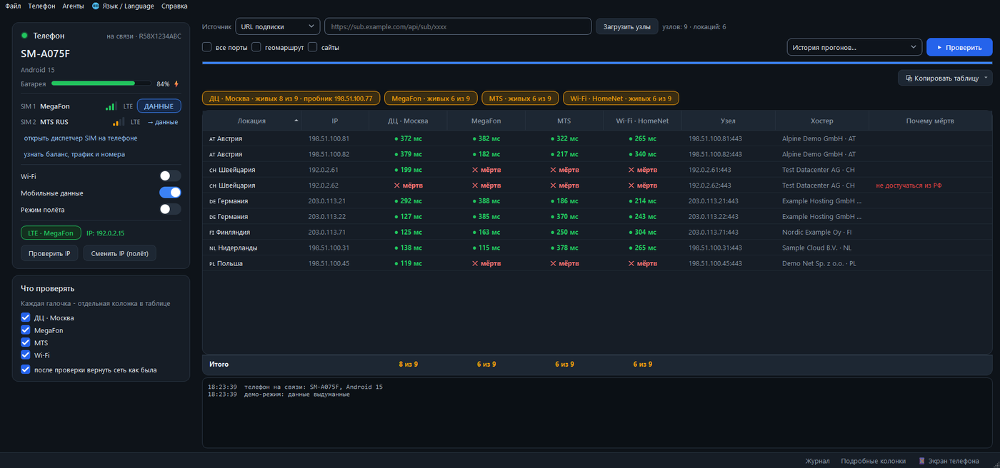
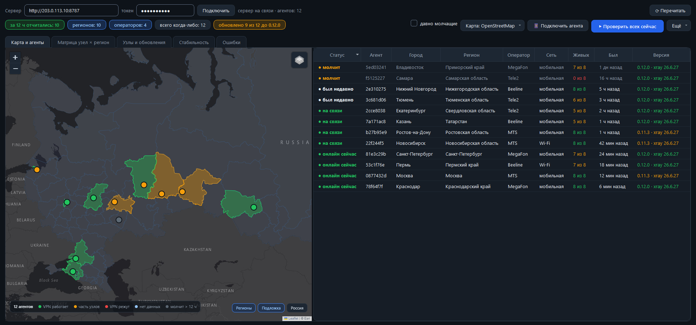
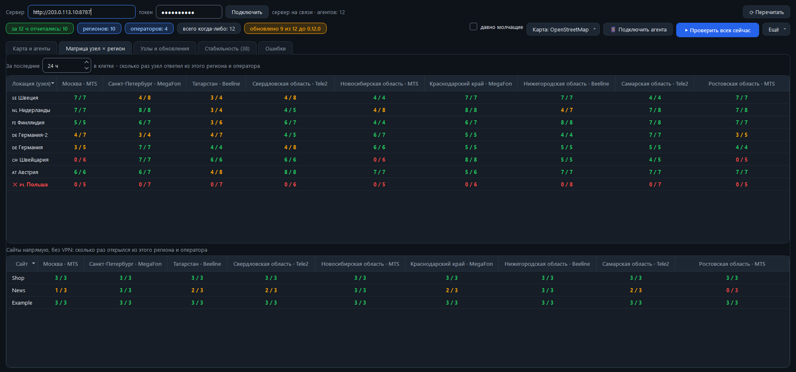
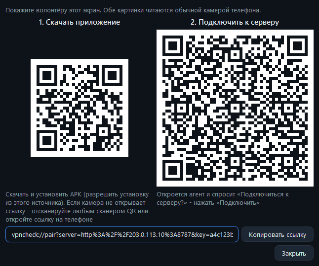
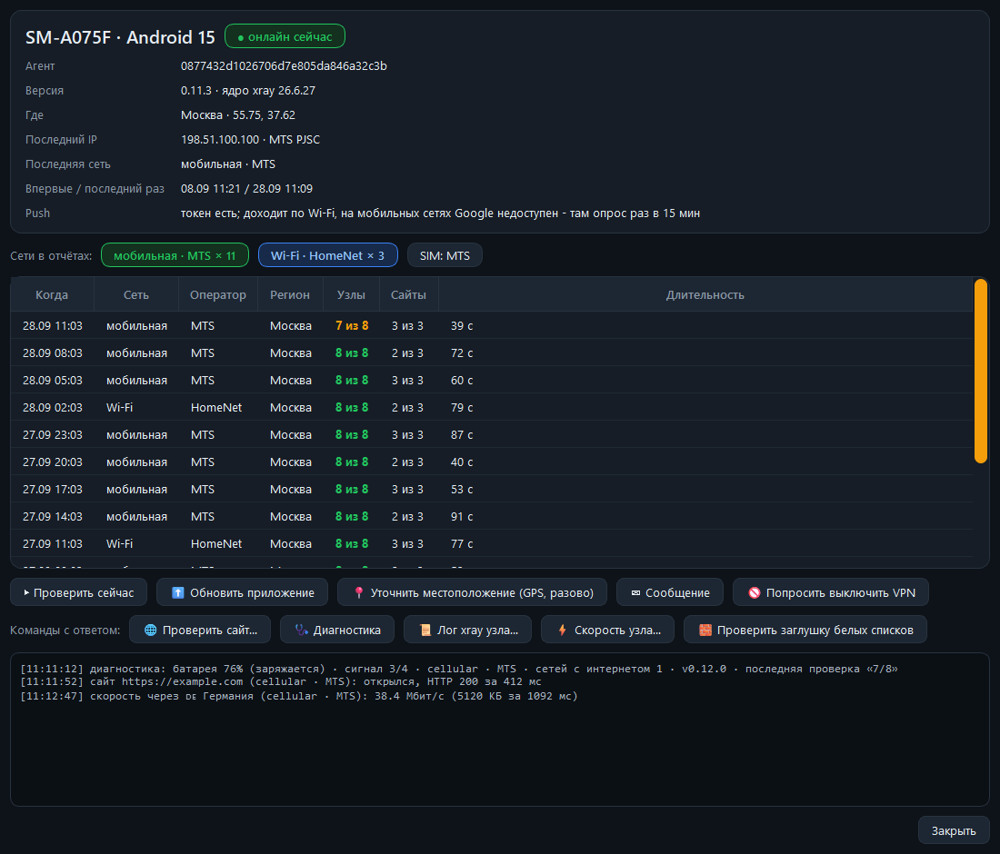

# VPNCheck Stand

[English version](README.md)

**VPNCheck Stand проверяет, открываются ли ваши VPN-узлы из настоящих сетей** - с SIM-карт разных операторов,
из домашнего Wi-Fi, из разных регионов. Сервер в дата-центре скажет, что узел жив, но не скажет, открывается ли
он сегодня вечером с телефона абонента конкретного оператора. Для этого нужна точка замера внутри этой сети.

Точки замера здесь такие:

- **телефоны на кабеле** - обычные Android-телефоны, подключённые к компьютеру по USB. Каждая SIM-карта
  и Wi-Fi телефона - отдельная колонка отчёта. Root не нужен;
- **точка в дата-центре** (по желанию) - ваш Linux-сервер, колонка «ДЦ» для сравнения;
- **волонтёры с агентом** (по желанию) - Android-приложение, которое раз в несколько часов проверяет узлы из
  сети волонтёра и присылает результат на ваш сервер. Все агенты видны на карте и в таблице «узел × регион».

**Кому пригодится:** тем, кто держит свои узлы на Xray (VLESS и всё, что умеет Xray), например с панелью
Remnawave, и хочет знать, у каких операторов и в каких регионах узлы открываются, а у каких нет.



## Содержание

- [Быстрый старт за 5 минут](#быстрый-старт-за-5-минут)
- [Установка стенда](#установка-стенда)
  - [Что нужно](#что-нужно)
  - [Первая проверка с телефоном](#первая-проверка-с-телефоном)
  - [Как читать отчёт](#как-читать-отчёт)
  - [Откуда брать узлы](#откуда-брать-узлы)
  - [Точка в дата-центре](#точка-в-дата-центре)
  - [Несколько телефонов](#несколько-телефонов)
  - [Прогон из консоли](#прогон-из-консоли)
  - [Обновить стенд](#обновить-стенд)
- [Сервер агентов](#сервер-агентов)
  - [Установка на сервере](#установка-на-сервере)
  - [Установка с Windows по SSH](#установка-с-windows-по-ssh)
  - [Подключить стенд](#подключить-стенд)
  - [Тревоги в Telegram](#тревоги-в-telegram)
  - [Резервные копии и объём базы](#резервные-копии-и-объём-базы)
  - [Шифрование (TLS)](#шифрование-tls)
- [Агент](#агент)
  - [Ключ подписи обновлений](#ключ-подписи-обновлений)
  - [Сборка APK](#сборка-apk)
  - [Выложить узлы и APK](#выложить-узлы-и-apk)
  - [Подключить волонтёра](#подключить-волонтёра)
  - [Что агент отправляет](#что-агент-отправляет)
- [Безопасность](#безопасность)
- [Частые проблемы](#частые-проблемы)
- [Справочник](#справочник)
  - [Как устроена проверка](#как-устроена-проверка)
  - [Где хранятся настройки](#где-хранятся-настройки)
  - [Что где лежит](#что-где-лежит)
  - [Разработка](#разработка)
- [Лицензия](#лицензия)

## Быстрый старт за 5 минут

Посмотреть программу можно без телефонов и серверов - в демо-режиме с выдуманными данными.

На Windows 10/11 откройте PowerShell:

```powershell
git clone https://github.com/SautovAndrey/vpncheck-stand.git
cd vpncheck-stand
powershell -ExecutionPolicy Bypass -File install.ps1
python app.py --demo
```

Нет Git - на странице репозитория нажмите **Code → Download ZIP**, распакуйте и запустите `install.ps1` из этой
папки (или поставьте Git: `winget install Git.Git`).

`install.ps1` ставит всё нужное: Python 3.12 (если нет Python 3.10+), `adb` и `scrcpy` через winget, пакеты
Python, ядро Xray для телефонов (официальный релиз XTLS/Xray-core, SHA-256 сверяется) и ярлык «VPNCheck Stand»
на рабочем столе. Запускать повторно можно - уже установленное пропускается.

На другой системе с Python 3.10+:

```bash
python -m pip install -r requirements.txt
python tools/fetch_binaries.py       # bin/xray, bin/geoip.dat, bin/geosite.dat + libxray.so для агента
python app.py --demo
```

## Установка стенда

Стенд - программа для компьютера (Python + Qt). Можно пользоваться только ею, а сервер агентов и агентов
добавить потом.

```
      Панель Remnawave (API-токен)  /  ссылка на подписку  /  файл
                              |
                              v
  +------------------- Стенд (компьютер с Windows) -------------------+
  |  таблица результатов, история прогонов, центр управления агентами |
  +------+-------------------+--------------------------+-------------+
         | USB / ADB         | SSH                      | HTTP(S) + админ-токен
         v                   v                          v
  Android-телефоны      Сервер в ДЦ               Сервер агентов (FastAPI, :8787)
  SIM 1 / SIM 2 / Wi-Fi (Linux, xray)             /v1/*, /admin, /agent.apk
  xray на телефоне,                                    ^              |
  без root                                      отчёты |              | узлы + подписанный
                                                       |              v манифест обновлений
                                                Телефоны волонтёров (приложение-агент)
                                                мобильная сеть / Wi-Fi, где угодно
```

### Что нужно

- **Компьютер:** Windows 10/11 (установщик и ярлык - под Windows), Python 3.10+, кабель с передачей данных для
  каждого телефона. Для двух и больше телефонов - USB-хаб с отдельным питанием.
- **Телефоны стенда:** Android 11 и новее, процессор arm64, включена «Отладка по USB», блокировка экрана -
  «Нет», включено «Не выключать экран». На Samsung (One UI) SIM для интернета переключается и ответы USSD
  читаются нажатиями по экранам самого телефона (системную настройку прошивка игнорирует), поэтому экран должен
  быть включён и разблокирован. Окна ищутся по тексту, см. `stand/phone.py`.
- **Телефоны агентов:** Android 8.0+ (API 26), arm64.
- **Для агентов:** панель Remnawave с API-токеном - узлы агентам выкладываются только из сквада панели (ссылка на
  подписку и файл работают только на стенде).
- **Сервер агентов:** Linux с Python 3.10+ (Debian 12 / Ubuntu 22.04+; установщик проверяет версию).
- **Сервер в ДЦ:** любой Linux-сервер с `python3` и `curl`. Это может быть та же машина, что и сервер агентов.

### Первая проверка с телефоном

1. Запустите ярлык, `VPNCheck Stand.bat` или `python app.py`.
2. Пройдите **Справка → Как подключить новый телефон**: режим разработчика и **«Отладка по USB»**, без
   блокировки экрана, «Не выключать экран», на Samsung - выключить «Автоблокировку» (Auto Blocker).
   Подключите кабель и разрешите отладку с этого компьютера («Всегда разрешать»). Через несколько секунд
   телефон появится в карточке **«Телефон»**.
3. Выберите источник узлов. Для первого раза проще всего **URL подписки** - вставьте ссылку на подписку.
   Нажмите **«Загрузить узлы»**, отметьте сети в **«Что проверять»** и нажмите **«Проверить»**.

`adb` должен быть в PATH (его ставит `install.ps1`); `scrcpy` - по желанию (живой экран телефона в окне,
**Телефон → Экран телефона**).

### Как читать отчёт

- **● 120 мс** - узел ответил из этой сети, число - задержка. Подсказка **«выход через …»** - IP, с которого узел
  вышел в интернет.
- **✕ мёртв** - узел не ответил и после перепроверки; **↻ ещё раз** - перепроверка идёт.
- **✕ БС** в серой колонке - SIM в режиме белых списков (оператор пускает только на разрешённые сайты): узел
  не открылся, но сам он может быть жив.
- Плашки над таблицей - итог по каждой сети: **«живых X из Y»**, для белых списков - сколько узлов открылось
  или **«колонка пропущена»**. Проверять такую колонку или пропускать - выбирается в **Настройках**.
- **ДЦ** - проверка с сервера в дата-центре. Жив в ДЦ и мёртв на SIM - скорее всего, узел недоступен именно
  в сети этого оператора.
- **«Почему мёртв»** - только у узлов, мёртвых везде: сервер в ДЦ проходит цепочку имя (DNS) → TCP → TLS, где она
  оборвалась - там и причина. Подробности во всплывающей подсказке.

Прогон сохраняется в историю, таблицу можно скопировать текстом, в Markdown или CSV.

### Откуда брать узлы

- **URL подписки** - любая ссылка на подписку.
- **Файл** - сохранённая подписка.
- **Панель Remnawave** - **Файл → Подключения (панели, пробник ДЦ)…** → **«Добавить»**: адрес панели и API-токен
  (в Remnawave: Settings → API Tokens) с правами на пользователей и сквады (сквад - группа узлов, которую
  получают клиенты). Перед каждым прогоном стенд создаёт в выбранном скваде временного пользователя, берёт его
  подписку - ровно тот набор узлов, что получают клиенты сквада, - и после проверки удаляет пользователя.
  Кнопка **«Проверить»** покажет, отвечает ли панель и какие в ней сквады. Если панель за прокси, которому
  нужны свои заголовки, их можно задать там же.

Понимаются: JSON-массив конфигов Xray/Happ (как отдаёт Remnawave), один JSON-конфиг Xray и список ссылок
`vless://` (как есть или в base64). По умолчанию проверяются только узлы на порту 443 - отметьте **«все порты»**
или снимите **Настройки → «По умолчанию только порт 443»**.

### Точка в дата-центре

По желанию. В окне **«Подключения»**, раздел **«Сервер-пробник - колонка «ДЦ»»**: адрес, SSH-порт, пользователь,
SSH-ключ или пароль. При первой проверке стенд сам поставит на сервер официальное ядро Xray в
`/opt/vpncheck-stand` (со сверкой SHA-256). **«Проверить вход»** - проверка доступа. Поле **«Место»** - подпись
колонки (`Москва` даёт **«ДЦ · Москва»**). Лучше всего сервер в той же стране, что и телефоны: тогда разница
между колонкой ДЦ и колонкой оператора показывает, что дело в сети оператора. Без этого сервера колонки ДЦ
и диагноза мёртвых узлов просто нет.

### Несколько телефонов

Телефонов можно подключить сколько угодно. Все отмеченные телефоны проверяются одновременно, а результат
сводится в один отчёт с колонками вида `MTS RUS · A075F`. Телефоны на одной точке Wi-Fi делят общую колонку
Wi-Fi и поровну раскладывают её узлы между собой. В карточке «Телефон» есть переключатель телефонов.

Ещё в карточке: SIM-карты, сигнал, какая SIM отдаёт интернет (**«→ данные»** переключает), Wi-Fi, мобильные
данные и режим полёта, внешний IP телефона (**«Проверить IP»**), **«Сменить IP (полёт)»** и **«узнать баланс,
трафик и номера»** - спрашивает оператора по USSD и читает ответные SMS (около минуты на SIM; коды для
российских операторов встроены, для незнакомого - `*100#`).

### Прогон из консоли

`run_check.py` - тот же движок без окна, результат появляется в истории программы.

```bash
python run_check.py mypanel Default                     # имя панели из «Подключений» + сквад
python run_check.py mypanel Default --modes dc,wifi     # только часть сетей: dc,sim1,sim2,wifi
python run_check.py mypanel Default --phone A075F       # один телефон (модель или серийник)
python run_check.py --url https://sub.example.com/abc   # ссылка на подписку вместо панели
python run_check.py --file nodes.txt
```

В `--modes` sim1/sim2 - слот SIM или имя оператора; список - `--list-modes`. Ещё ключи: `--location`,
`--all-ports`, `--ports 443,2053`, `--merge` (дописать колонки в последний сегодняшний прогон), `--geo`,
`--no-restore`, `--title`. Полный список - `python run_check.py --help`.

### Обновить стенд

```powershell
cd vpncheck-stand
git pull
powershell -ExecutionPolicy Bypass -File install.ps1
```

Если в новой версии закреплена другая версия Xray, `install.ps1` сам скачает новое ядро для телефонов
(установленная версия записана в `bin\xray.version`). Ставили из ZIP - скачайте ZIP заново, распакуйте поверх
и запустите `install.ps1`. Настройки хранятся отдельно и не теряются.

## Сервер агентов

Небольшой сервис на FastAPI: раздаёт агентам список узлов, принимает отчёты, шлёт тревоги в Telegram и отдаёт
подписанные обновления приложения. Нужен, только если вы хотите агентов у волонтёров.

### Установка на сервере

На Debian/Ubuntu от root (на минимальном Debian сначала `apt-get install -y git` или скачайте ZIP с GitHub):

```bash
git clone https://github.com/SautovAndrey/vpncheck-stand.git && cd vpncheck-stand
sudo bash server/install.sh
```

Установщик печатает адрес сервера, ссылку на страницу `/admin` и **админ-токен**. Повторный запуск обновляет
код и сохраняет базу, токен и прошлые настройки. Обновить сервер: `git pull && sudo bash server/install.sh`.

<details>
<summary>Что именно делает установщик</summary>

Нужен Python 3.10+: на более старой системе скрипт остановится с понятным сообщением. Код и venv ставятся
в `/opt/vpnagent` (владелец root), данные - база, настройки из стенда, резервные копии, загруженные файлы -
в `/opt/vpnagent/data`. Systemd-сервис `vpnagent` на порту 8787 работает от своего системного пользователя
`vpnagent` (не root) и может писать только в `/opt/vpnagent/data`. Скрипт открывает порт в ufw, если он включён.
При повторном запуске не заданная переменная оставляет прежнее значение (Telegram, язык, порт, адрес
прослушивания). Старая установка, где всё лежало прямо в `/opt/vpnagent`, переделывается сама: сервис
останавливается, данные переезжают в `data/`, код и venv ставятся заново; из старого файла `env` переносятся
только известные настройки (свои, `VPNAGENT_*` и прокси), остальное убирается с предупреждением.

Ещё скрипт один раз кладёт `/etc/sysctl.d/90-vpnagent.conf` (TCP keepalive 180/30/3 - оборванные мобильным NAT
соединения долгого опроса закрываются быстрее); уже существующий файл не трогает. Сервис запускается через
`server/run.py`: uvicorn с тем же keepalive на каждом соединении; соединение, по которому за 30 секунд не пришёл
полный запрос, закрывается; заголовки запроса - до 64 КБ; с одного адреса - до 256 соединений; памяти - не больше
1500 МБ (`MemoryMax`).

</details>

Переменные окружения для установщика (все по желанию):

| Переменная | Что задаёт |
|---|---|
| `VPNCHECK_LANG=en` | язык текстов сервера (ошибки API, тревоги в Telegram); по умолчанию `ru` |
| `TG_BOT_TOKEN`, `TG_ADMIN` | токен Telegram-бота и chat id для тревог; пустое значение выключает тревоги |
| `PORT` | порт, по умолчанию 8787 |
| `VPNAGENT_TLS_PORT` | шифрованный порт для агентов, по умолчанию 8788; `0` - выключить (см. [Шифрование](#шифрование-tls)) |
| `TLS_NAME` | имя в новом сертификате (по умолчанию внешний IP сервера); проверяется отпечаток, а не имя |
| `VPNAGENT_TLS_REGENERATE=1` | новый ключ TLS вместо прежнего (`deploy.py --new-tls-key`) |
| `BEHIND_PROXY=1` | слушать только `127.0.0.1` и не открывать порт - для TLS-прокси на той же машине; `BEHIND_PROXY=0` возвращает `0.0.0.0` |
| `HOST` | адрес прослушивания, по умолчанию `0.0.0.0` |
| `ADMIN_TOKEN` | задать админ-токен (иначе остаётся текущий, при первой установке придумывается новый) |
| `ENV_FILE` | взять переменные выше из файла `KEY=VALUE`, а не из командной строки; файл удаляется после чтения (так делает `deploy.py`, чтобы токены не было видно в списке процессов) |

```bash
sudo TG_BOT_TOKEN=123:ABC TG_ADMIN=123456 bash server/install.sh
```

Push через Firebase - по желанию: перед установкой положите ключ сервисного аккаунта Firebase в
`server/service-account.json`. Без него агенты всё равно получают команды через свой канал долгого опроса.

### Установка с Windows по SSH

Если сервер в ДЦ уже настроен в **«Подключениях»**, `python server/deploy.py` зальёт сервер агентов на ту же машину
по SSH и запустит там тот же `server/install.sh`. Админ-токен и настройки Telegram берутся из `agent.json`
(`token`, `tg_bot_token`, `tg_admin`), если они там заданы, и передаются файлом с правами 600 во временной
закрытой папке, не в командной строке; иначе сервер оставляет свои. В конце токен сохраняется в `agent.json`,
а адрес сервера - только если его там ещё нет. Пользователь SSH - root или с `sudo` без пароля.

```bash
python server/deploy.py                   # поставить или обновить
python server/deploy.py --behind-proxy    # только 127.0.0.1, для TLS-прокси на сервере
python server/deploy.py --lang en --port 9000
python server/deploy.py --new-tls-key     # сменить ключ TLS
```

### Подключить стенд

**Агенты → Центр управления агентами**: впишите адрес сервера (например `http://203.0.113.10:8787`) и админ-токен,
нажмите **«Подключить»**. То же самое с телефона - страница `http://<сервер>/admin` (данные грузятся только
с админ-токеном).

Новые агенты попадают в матрицу и стабильность через сутки после подключения - так выдуманные агенты не исказят
картину; их отчёты сразу видны в карточке агента.





Карта работает и без ключа (Leaflet, подложки Esri и OpenStreetMap). Для Яндекс Карт получите ключ «JavaScript
API и HTTP Геокодер» в кабинете разработчика Яндекса (<https://developer.tech.yandex.ru>) и впишите его: кнопка
карты → **«Ключ Яндекс Карт…»**. Стенд хранит его в `agent.json` и отправляет на сервер; страница `/admin`
показывает карту только с этим ключом.

Если ставите перед сервером свой HTTPS-прокси: агенты держат запрос долгого опроса открытым до 4 минут, поэтому
таймаут чтения нужен не меньше 300 секунд (nginx: `proxy_read_timeout 300s`).

### Тревоги в Telegram

**Как включить:** создайте бота у @BotFather (`/newbot`) - он выдаст токен для `TG_BOT_TOKEN`. Напишите своему
боту любое сообщение и откройте `https://api.telegram.org/bot<ТОКЕН>/getUpdates` - число в `"chat":{"id":…}`
и есть `TG_ADMIN` (для группы добавьте бота в неё; id начинается с `-`). Запустите установщик ещё раз с обеими
переменными: в конце он напишет, включены ли тревоги, и пришлёт пробное сообщение.

**Когда приходят:** выложенный узел перестал отвечать в каком-то месте (регион и оператор) или снова отвечает;
все агенты видят ноль живых узлов; учётка узлов агентов истекает через 3 дня, через 1 день и когда истекла;
база заполнена на 80% от предела. Одиночный сбой тревогу не поднимает, события за 10 минут приходят одним
сообщением, всего не больше 20 сообщений в час. Все тревоги видны в стенде: Агенты → Центр управления агентами →
«Стабильность» - даже если бот не настроен.

<details>
<summary>Подробные правила тревог</summary>

- **Что не будит:** агенты, известные меньше 24 часов, узел меньше чем с 3 проверками, узлы и сайты, не
  выложенные на сервер. «Все агенты в нуле» - только если за последние 3 часа отчитались агенты хотя бы из
  3 разных сетей (домашний Wi-Fi или адрес оператора).
- **Порог:** «перестал отвечать» в каком-то месте - после 2 неудачных проверок подряд, если за 3 часа там не
  меньше 3 неудач и не меньше 60% из 8 последних проверок. Где за 3 часа меньше 3 проверок - 4 неудачи подряд
  или 3, если они у двух разных агентов. Если узел за сутки уже падал в другом месте с агентами хотя бы из двух
  сетей, хватает 2 неудач подряд. Если узел ожил раньше, чем ушло сообщение, тревога выбрасывается (прождавшая
  больше 10 минут - остаётся в истории как «не отвечал с - по»).
- **Снова отвечает:** приходит, только если про это место было «перестал отвечать». Пока узел ещё где-то не
  отвечает, такие сообщения по нему приходят не чаще раза в 3 часа (одна строка на все места); «теперь отвечает
  везде» - сразу. Место, где узел не проверяли 48 часов, забывает своё «перестал отвечать» молча.
- **Работает с перебоями:** узел, сменивший состояние 5 раз за сутки в одном месте и живой там в 20-80%
  проверок, ставится на паузу в этом месте (не меньше суток, другие места тревожат как обычно). Если в месте
  есть агенты хотя бы из двух сетей, приходит одно сообщение «работает с перебоями» с тем, в скольких местах
  узел сейчас не отвечает. В других местах узел после этого глохнет, только если и там то падает, то оживает
  (20-80% живых проверок за сутки); обычное падение там приходит как обычно, и «снова отвечает» после падения
  дольше 6 часов - тоже. Когда пауза кончится, приходит итог: «так и не отвечает после перебоев» или «снова
  отвечает» - и после молчаливой паузы, если узел в её начале не отвечал; если узел там всё ещё то падает, то
  оживает, или место не проверяли, пауза молча продлевается. «Работает с перебоями», не ушедшее до конца паузы
  (молчал Telegram), не отправляется - только в историю.
- **Лимиты:** «перестал отвечать» про одно и то же место и узел - не чаще раза в 6 часов; событие внутри этих
  6 часов не теряется, а ждёт в очереди их конца. Предупреждения об учётке, «0 живых у всех» и о заполнении базы
  приходят, даже если лимит в час уже выбран.
- **Все агенты в нуле:** пока половина сетей агентов и больше видят ноль живых узлов, тревоги по узлам ждут
  (до 3 часов) - похоже на поломку у нас, а не у операторов. Когда в нуле все, вместо «перестал отвечать»
  приходит одно сообщение «0 у всех», а если учётка узлов уже истекла - «учётка истекла».
- **Если Telegram недоступен:** тревоги ждут в очереди (до 90 дней), к тем, что старше часа, дописано
  «· было 5 ч назад» (от 48 часов - «· было 3 дн. назад»); в лимит идут только доставленные сообщения.
  Сообщение режется до 3900 символов («…и ещё N»). Сообщение, которое Telegram не принял, не повторяется: оно
  попадает в журнал ошибок, а в истории помечено «(в Telegram не ушло)».

</details>

### Резервные копии и объём базы

Раз в сутки сервер делает резервную копию базы (`*.db.gz`), хранит 7 ежедневных и 4 недельных; если места на
диске не хватает, копия пропускается с записью в журнал ошибок.

**Восстановление.** Не распаковывайте `.db.gz` поверх `agents.db` руками: оставшийся `agents.db-wal` смешается
с восстановленной базой и испортит её. Скрипт `restore.sh` проверяет копию, останавливает сервис, откладывает
текущую базу вместе с `-wal`/`-shm` в `agents.db.broken-<время>`, ставит копию на место и запускает сервис:

```bash
sudo bash /opt/vpnagent/restore.sh            # список копий
sudo bash /opt/vpnagent/restore.sh 20260927   # восстановить agents-20260927.db.gz
```

**Объём.** База ограничена 2 ГБ (`VPNAGENT_MAX_DB_MB`, по умолчанию 2048). На 80% сервер один раз предупредит
в Telegram (снова - только после того, как база опустится ниже 70%), у предела первыми удаляются самые старые
отчёты - об этом отдельное сообщение, не чаще раза в неделю; в обоих есть готовая команда, как поднять предел.
Для примера: 150 агентов и 300 узлов пишут около 63 МБ в сутки, на 90 дней истории нужно около 6 ГБ. Поднять
предел (для бэкапа на диске должно быть свободно примерно вдвое больше размера базы; установщик строку
сохранит):

```bash
echo VPNAGENT_MAX_DB_MB=6144 | sudo tee -a /opt/vpnagent/env && sudo systemctl restart vpnagent
```

С одного адреса (домашний Wi-Fi, мобильный NAT) могут работать до 48 агентов. Регион по адресу агента
определяется не больше чем 1500 новыми запросами в сутки, остальное берётся из кэша.

### Шифрование (TLS)

Кроме порта 8787 сервер открывает шифрованный порт 8788 для агентов (`VPNAGENT_TLS_PORT`). При первой установке
в `/opt/vpnagent/tls` создаётся самоподписанный сертификат ECDSA на 10 лет, установщик печатает
`TLS pin: sha256/...`. `deploy.py` сохраняет порт и отпечаток в стенде, стенд кладёт их в подписанный манифест
обновлений, и агенты дальше ходят на сервер только по TLS с этим отпечатком. Откройте этот порт и в фаерволе
хостера.

- Повторная установка сертификат не меняет (только чинит владельца и права); битая или несовпадающая пара
  останавливает установку, а не создаёт молча новый ключ.
- Новый ключ - `deploy.py --new-tls-key`; прежняя пара остаётся рядом как `*.pem.old.<pid>`. Агенты 0.12.11+
  перейдут на него по подписанному манифесту; агенты 0.12.9-0.12.10 замолчат до переустановки приложения.
- **Сохраните `/opt/vpnagent/tls` вместе с базой.** Сервер раз в сутки копирует пару в
  `data/backups/tls-ГГГГММДД.tar` (права 600), но копия на том же диске пропадёт вместе с VPS - унесите папку
  и за пределы сервера. На новой машине верните папку в `/opt/vpnagent/tls` до запуска установщика или
  `deploy.py` (владелец любой - установщик исправит) или восстановите после:

  ```bash
  sudo bash /opt/vpnagent/restore.sh tls            # список копий TLS
  sudo bash /opt/vpnagent/restore.sh tls 20260927   # вернуть tls-20260927.tar, затем python server/deploy.py
  ```

- `/health` отвечает `"tls": true`, пока TLS-порт поднят. Если он не поднялся (ключ не читается, порт занят),
  сервер работает по http, пишет причину в журнал ошибок и шлёт одну тревогу в Telegram в сутки; `deploy.py`
  и центр управления громко предупреждают, если у стенда есть отпечаток, а TLS-порта нет.
- С TLS на http агенты возвращаются только по более новому подписанному манифесту без `tls`: когда TLS выключен
  (`VPNAGENT_TLS_PORT=0`, `--behind-proxy`) или не поднялся, `deploy.py` перевыкладывает манифест без него.
- В центре у агентов, которые уже ходят по TLS, рядом с версией стоит `https`, а плашка «по https: N из M»
  подскажет, когда можно закрывать порт 8787 - только когда там все.

## Агент

Android-приложение для волонтёров. Раз в несколько часов проверяет узлы из своей сети и шлёт результат на сервер
агентов. Из SIM-карт проверяет только ту, что выбрана для мобильного интернета: вторую SIM Android стороннему
приложению не даёт. Соединения привязаны к проверяемой сети, поэтому мобильная сеть проверяется честно и при
включённом Wi-Fi.

### Ключ подписи обновлений

Агент ставит обновления, только если манифест подписан ключом Ed25519, который лежит на компьютере со стендом
(`%APPDATA%\VPNCheckStand\keys\manifest_ed25519.key` и `manifest_ed25519.pub`). Создать один раз (существующий
ключ скрипт не перезаписывает):

```powershell
python tools/make_keys.py
```

Команда напечатает публичный ключ - 64 шестнадцатеричных символа. Сохраните копию закрытого ключа вне
компьютера: если он потеряется, обновления с новым ключом агенты примут только после повторного подключения
по QR.

### Сборка APK

Нужны JDK 17 и Android SDK 35 (или просто Android Studio). Сам Gradle скачает обёртка gradlew.

```bash
python tools/fetch_binaries.py      # кладёт libxray.so в agent/app/src/main/jniLibs/arm64-v8a/
cd agent
gradlew.bat assembleRelease          # Linux/macOS: ./gradlew assembleRelease; или открыть agent/ в Android Studio
```

Готовый APK - `agent/app/build/outputs/apk/release/app-release.apk`. По желанию - `agent/keystore.properties`
(в git не попадает):

```properties
storeFile=/path/to/release.jks
storePassword=...
keyAlias=...
keyPassword=...
server=http://203.0.113.10:8787
manifestPubKey=<64 символа из предыдущего шага>
```

- `storeFile` / `storePassword` / `keyAlias` / `keyPassword` - свой ключ подписи APK. Без него сборка
  подписывается отладочным ключом Android: чтобы попробовать, хватит, но Android ставит обновление только
  поверх APK с той же подписью - для раздачи людям заведите свой ключ.
- `server`, `manifestPubKey` - значения по умолчанию, зашитые в приложение. Обычно их задаёт QR-код, так что
  они не обязательны.
- Push через Firebase - по желанию: положите свой `google-services.json` в `agent/app/`.

Для каждого нового выпуска поднимайте `versionCode` в `agent/app/build.gradle.kts`.

### Выложить узлы и APK

В центре управления, вкладка **«Узлы и обновления»**:

- **«Выложить узлы этого сквада»** - выберите панель и сквад. Стенд заводит в панели отдельного пользователя
  для агентов (имя начинается с `vpnagent`, лимит 500 МБ трафика, срок 30 дней) и выкладывает его узлы на
  сервер. Выкладывайте заново до истечения 30 дней - сервер напомнит в Telegram за 3 дня и за 1 день.
- **«Выложить APK приложения…»** - загружает APK и подписывает манифест обновлений. После этого
  `http://<сервер>/agent.apk` всегда отдаёт актуальный APK. Ядро xray едет внутри APK.
- Там же: интервал проверки, сообщение агентам на экран приложения, сайты для проверки без VPN, адреса
  определения IP и замера задержки и **«Точность геолокации»** - насколько грубо агенты сообщают, где они.

Узлы, которые агент не может проверить честно и безопасно, он не проверяет, а сообщает причину. Это, например,
лишние поля в `freedom` (разрешены только `domainStrategy`, `fragment`, `noises`, `userLevel`), свой
`addressPortStrategy`, канал загрузки xhttp через другой узел, ключи, которые отличаются от имён xray только
регистром, и поля не из белого списка `stand/node_fields.json`. Подробности - в [SECURITY.md](SECURITY.md).

### Подключить волонтёра

**Агенты → Центр управления агентами → «Подключить агента»** показывает два QR-кода, оба читаются обычной
камерой телефона:

1. **«Скачать приложение»** - `http://<сервер>/agent.apk`, волонтёр ставит APK.
2. **«Подключить к серверу»** - ссылка `vpncheck://pair?server=...&key=...` с адресом сервера и публичным
   ключом подписи. Агент спросит «Подключиться к серверу?» и запомнит и то и другое.



Дальше волонтёр соглашается на экране согласия и, чтобы проверки шли сами, разрешает приложению работу в фоне
без ограничений в настройках батареи. Язык приложения - как на телефоне (русский или английский).

Из центра можно запустить проверку у всех, разослать обновление, смотреть карту, матрицу «узел × регион»,
стабильность за неделю и журнал ошибок. В окне отдельного агента - команды: проверить сейчас, обновить, уточнить
местоположение, сообщение, попросить выключить VPN, диагностика, проверка сайта, лог xray, замер скорости,
проверка заглушки белых списков.



### Что агент отправляет

Что собирается, волонтёр видит на экране согласия. По коду (`agent/.../CheckWorker.kt`, `NetInfo.kt`,
`Diag.kt`, `Commands.kt`, `LocateTask.kt`):

**С каждой проверкой (отдельный отчёт на каждую сеть - Wi-Fi и активную мобильную):**

- случайный номер агента, созданный при установке; версии приложения и ядра; модель телефона и версия Android;
- тип сети (Wi-Fi / мобильная), название оператора и оператора SIM, код сети MCC-MNC, тип связи (LTE, 5G…),
  включён ли VPN;
- по каждому узлу: ответил ли и за сколько; по каждому заданному сайту: открылся ли, код HTTP, время;
- внешний IP телефона, каким его увидел сервис определения IP (сервер тоже видит адрес, с которого пришёл
  отчёт, и узнаёт по нему город и провайдера через ipinfo.io);
- приблизительное местоположение - только если волонтёр разрешил: берётся только пока приложение открыто,
  по вышкам и Wi-Fi без GPS, округляется до точности из центра (по умолчанию около 500 м), плюс город
  и регион от геокодера телефона;
- push-токен Firebase (если push настроен) и журнал ошибок самого приложения.

**Только по запросу из центра:** снимок состояния (заряд, зарядка, экономия энергии и фоновые ограничения,
уровень сигнала, состояние SIM, настройки агента, последние ошибки); разовая точная GPS-координата - без
округления и только если волонтёр дал доступ к точному местоположению, иначе приложение покажет уведомление
с просьбой открыть его; результат проверки сайта, лог xray по одному узлу, замер скорости через узел (скачивает
около 8 МБ) или проверка белых списков (что отдаёт обычная HTTP-страница neverssl.com в этой сети).

**Не отправляется:** номер телефона, IMEI и серийные номера, контакты, SMS, список приложений, история
браузера и содержимое трафика. Приложение не работает как VPN для волонтёра - оно только открывает короткие
пробные соединения. Команды с сервера - закрытый список, выполнить произвольный код на телефоне нельзя.

Выйти можно в любой момент кнопкой в приложении или удалив его.

## Безопасность

Модель угроз, что уже защищено, рекомендации и как сообщить об уязвимости - в [SECURITY.md](SECURITY.md)
(по-английски). Коротко: админ-токен даёт полный доступ к серверу агентов - храните его как пароль; обновления
агентов принимаются только с вашей подписью Ed25519; агенты ходят на сервер по TLS с закреплённым отпечатком;
для чего-то серьёзнее проверки поставьте перед портом 8787 HTTPS
(см. [SECURITY.md](SECURITY.md#recommendations)).

## Частые проблемы

- **Телефон не виден.** Кабель только для зарядки - возьмите кабель с передачей данных. Не нажали «Всегда
  разрешать» в окне отладки на телефоне - переподключите кабель. На Samsung включена «Автоблокировка».
- **Все узлы красные на SIM.** SIM в режиме белых списков (смотрите плашку колонки) или на телефоне включён
  VPN - выключите его.
- **Агенты молчат.** Телефон усыпляет приложение ради батареи - в приложении агента разрешите работу без
  ограничений батареи и, если есть, «Автозапуск».
- **Потерялся админ-токен.** На сервере: `sudo cat /opt/vpnagent/admin_token`; на компьютере со стендом -
  в `%APPDATA%\VPNCheckStand\agent.json`.
- **У всех агентов разом 0 живых.** Истекла учётка узлов агентов `vpnagent_*` в панели (живёт 30 дней) -
  перевыложите узлы: Агенты → Центр управления агентами → **«Узлы и обновления»** → **«Выложить узлы этого
  сквада»**.
- **Тревоги не приходят в Telegram.** Посмотрите «Ошибки» в центре управления (строки «сервер · Telegram: не
  отправлено» объясняют причину) и запустите установщик ещё раз: в конце он пришлёт пробное сообщение.
- **pip падает с «No such file or directory … PySide6 … .cpp.obj»** - слишком длинный путь к папке. Создайте
  venv в короткой папке (например `C:\vpncheck\venv`) или включите длинные пути:
  `reg add HKLM\SYSTEM\CurrentControlSet\Control\FileSystem /v LongPathsEnabled /t REG_DWORD /d 1 /f`
  (от администратора) и повторите pip.

## Справочник

### Как устроена проверка

1. Стенд управляет телефоном по USB через ADB (штатная отладка Android). Связь идёт не по сети, поэтому
   телефон может переключать сети как угодно - управление не теряется.
2. Один раз на каждый телефон стенд заливает официальное ядро Xray в `/data/local/tmp`. Root и Termux не нужны.
3. Для каждого узла стенд запускает на телефоне xray с настройками этого узла, пробрасывает его локальный
   SOCKS-порт на компьютер (`adb forward`) и через него запрашивает сервис, который отвечает внешним IP,
   и адрес `generate_204`. Есть ответ - узел открывается из этой сети, время ответа - задержка.
4. Сети проверяются по очереди: SIM 1, SIM 2, Wi-Fi (мобильный интернет между SIM-картами и Wi-Fi стенд
   переключает сам), колонка ДЦ - параллельно с сервера в ДЦ. Не ответившие узлы перепроверяются с большей
   паузой.
5. По узлам, мёртвым везде, сервер в ДЦ ставит диагноз: имя (DNS) → TCP → TLS с SNI узла. Где цепочка
   оборвалась - там, скорее всего, и причина.

### Где хранятся настройки

Всё личное хранится вне папки программы, в `%APPDATA%\VPNCheckStand` (на других системах - `~/VPNCheckStand`):

| Файл | Что внутри |
|---|---|
| `settings.json` | вид окна, параметры прогона и номера SIM телефонов стенда |
| `connections.json` | панели Remnawave (адрес, API-токен) и сервер в ДЦ (SSH) |
| `agent.json` | адрес сервера агентов и админ-токен, настройки карты, по желанию настройки Telegram для `deploy.py` |
| `keys/` | ключ подписи обновлений (`manifest_ed25519.key` / `.pub`) |
| `runs/` | история прогонов |
| `errors.log` | журнал ошибок стенда (вкладка «Ошибки» центра агентов) |

Язык интерфейса - меню **🌐 Язык / Language** (или Файл → Настройки… → «Язык интерфейса»): как в системе /
русский / английский; программа предложит перезапуститься. Переменная окружения `VPNCHECK_LANG` перекрывает
настройку.

### Что где лежит

| Путь | Что это |
|---|---|
| `app.py` | запуск стенда (`--demo`, `--screen`, `--screenshot ФАЙЛ --delay N`) |
| `run_check.py` | прогон из консоли |
| `install.ps1`, `VPNCheck Stand.bat` | установщик и запуск под Windows |
| `stand/` | движок стенда: `adb.py`, `phone.py` (состояние телефона, переключение SIM, USSD/SMS), `xray.py`, `checker.py` (один прогон), `multiphone.py`, `dcprobe.py` (сервер в ДЦ и диагноз), `remnawave.py`, `subscription.py`, `agentapi.py` (клиент сервера агентов, подпись манифеста), `storage.py`, `i18n.py` |
| `stand/ui/` | интерфейс на Qt: главное окно, карточка телефона, экран телефона, подключения, центр агентов, QR для подключения |
| `stand/locale/en/` | английские переводы (`{русский текст: английский}`) |
| `server/` | сервер агентов: `app.py` (FastAPI), `fcm.py` (push по желанию), `static/admin.html` + `admin.js`, `install.sh`, `deploy.py` |
| `agent/` | Android-агент (Kotlin) |
| `tools/` | `fetch_binaries.py` (скачать ядро Xray), `make_keys.py` (ключ подписи обновлений), `i18n_check.py` (проверка переводов), `screenshots.py` (снимки для README на выдуманных данных), `make_public.py` (чистая копия для публикации) |
| `tests/` | тесты |

Бинарники (ядро Xray, geo-файлы, `libxray.so`) в репозитории не хранятся - их скачивает
`tools/fetch_binaries.py`. Версия Xray закреплена в `stand/dcprobe.py`, чтобы телефоны, сервер в ДЦ и агенты
мерили одним и тем же ядром.

### Разработка

```bash
python -m pip install -r requirements.txt -r server/requirements.txt -r requirements-dev.txt
python -m pytest tests
python -m ruff check .
python tools/i18n_check.py            # у каждой строки t("...") есть английский перевод
python tools/i18n_check.py --unused   # плюс переводы, которых в коде уже нет
python tools/screenshots.py           # переснять docs/screenshots (нужен Pillow из requirements-dev.txt)
python -m bandit -c pyproject.toml -r .   # проверка безопасности; разобранные пропуски - в pyproject.toml
python -m pip_audit -r requirements.txt -r server/requirements.txt   # известные уязвимости зависимостей
cd agent && ./gradlew detekt          # проверка Kotlin-кода агента (на Windows - gradlew.bat)
```

Тесты интерфейса (`tests/ui/`) идут на pytest-qt и работают без экрана (`QT_QPA_PLATFORM=offscreen`).

Тексты интерфейса пишутся в коде по-русски и оборачиваются в `t()`, английские - в `stand/locale/en/*.json`.
Добавили или поменяли строку - добавьте перевод и запустите `tools/i18n_check.py`. Строки, которые попадают
в `t()` через переменную (подписи колонок, диагнозы, демо-локации), перечислены в `stand/locale/dynamic.txt`
по одной на строку: для них проверка требует перевод и не считает их лишними. У сервера свои немногие английские
строки прямо в `server/app.py`, у агента - обычные ресурсы Android (`res/values`, `res/values-ru`).

## Лицензия

[MIT](LICENSE). Сторонние компоненты (Leaflet, Natural Earth, Xray-core и другие) перечислены в
[THIRD_PARTY_NOTICES.md](THIRD_PARTY_NOTICES.md).

---

По вопросам обхода белых списков и настройки VPN - пишите в Telegram: https://t.me/joodjoy.
